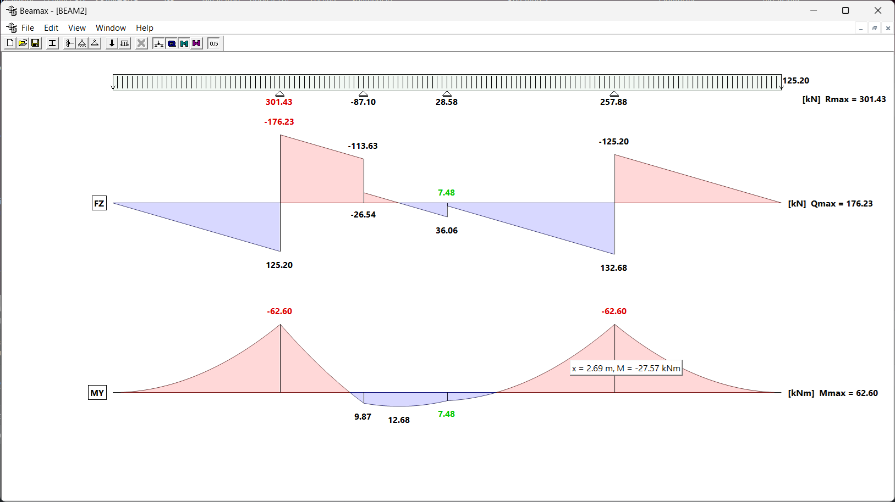

# Beamax

Beamax is an educational application for creating, editing, and analyzing statically determinate and indeterminate beam structures. Designed for structural engineering students and educators.

## Visual Comparison

<strong>Beamax UI Comparison (v2.4 vs v3.0)</strong>

  

    
    
<em>Beamax 2.4</em>

  

  

    
    
<em>Beamax 3.0</em>

  

---

## Changelog – Beamax 2.4 → 3.0

- Increased font size (9pt → 16pt)
- Anti-aliasing enabled for smoother lines
- Display of Mmax, Qmax, Rmax next to diagrams
- Maximum values shown in red
- Minimum values (by absolute value) shown in green
- Reactions are now correctly calculated and displayed
- DPI awareness for high-resolution screens
- Improved label positioning to avoid overlap
- Fixed memory and GDI leaks (fonts, pens, graphics)

---
